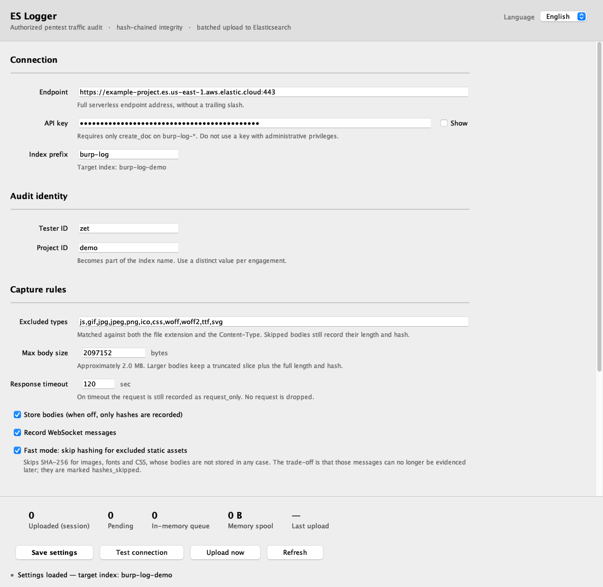

# ES Logger

[](https://github.com/cymetrics/burp-es-logger/actions/workflows/build.yml)
[](LICENSE)

A Burp Suite extension that mirrors the HTTP and WebSocket traffic Burp handles into
Elasticsearch, so an engagement's requests stay searchable long after the Burp project is closed.
Records are hash-chained, which makes later edits to the stored copy detectable.

**What it is not: a complete record of an engagement.** It sees what passes through Burp and
nothing else — sqlmap, ffuf, nuclei, nmap and any unproxied script are simply absent. See
[Scope](#scope).

> 中文說明請見 [README.zh-TW.md](README.zh-TW.md)



## Why

A Burp project file is a poor archive: it is a single machine's binary blob, it is slow to search,
and it is gone when the laptop is rebuilt. This keeps the same traffic in Elasticsearch, one index
per engagement, with every record tagged by tool, tester and session — so "what did I send to this
host with Repeater last Tuesday" is a query rather than an afternoon.

## What it does

- **Captures everything Burp sends.** Hooks `api.http()`, so Proxy, Repeater, Intruder, Scanner and
  other extensions are all covered — not just proxied browser traffic.
- **Pairs requests with responses** by `messageId`. A request that never gets a response is still
  written as `request_only` once it times out, so nothing silently disappears.
- **Decides what is worth storing.** Bodies are filtered by file extension and Content-Type and
  capped in size, so an index stays queryable instead of filling with PNG bytes. Excluded bodies
  still record their length and digest.
- **Never duplicates.** `_bulk` uses `create` with a client-generated `_id`, so a resend after a
  network failure returns 409 and is treated as already stored.
- **Stays out of your way.** The capture callback only grabs bytes and hands them to a background
  thread. Uploads use a JDK `HttpClient` pinned to `NO_PROXY`, so the extension never logs its own
  traffic and the API key cannot reach the proxy history.

## Quick start

1. **Download** `burp-es-logger.jar` from [Releases](https://github.com/cymetrics/burp-es-logger/releases)
   and verify it:
   ```bash
   shasum -a 256 -c burp-es-logger.jar.sha256
   ```
2. **Prepare Elasticsearch** — [`elasticsearch/setup.md`](elasticsearch/setup.md) creates the index
   template and an append-only API key that can create documents but cannot read, overwrite or
   delete them. [`elasticsearch/dev-tools.txt`](elasticsearch/dev-tools.txt) is the same thing ready
   to paste into Kibana's Dev Tools.
3. **Load the extension** — Burp → Extensions → Add → Extension type **Java** → select the jar. An
   **ES Logger** tab appears. Turn on **Auto-reload** if you plan to rebuild it.
4. **Fill in the tab** — endpoint, API key, index prefix, tester ID, project ID → **Save settings**
   → **Test connection**. A 403 there is expected and explained; a 401 is not.

## Scope

The extension hooks `api.http()`, so everything **Burp** sends is covered. Nothing outside Burp is.
Most tools can be pointed at Burp's proxy, which brings them into the same log:

```bash
sqlmap --proxy http://127.0.0.1:8080
ffuf   -x http://127.0.0.1:8080
nuclei -proxy http://127.0.0.1:8080
curl   -x http://127.0.0.1:8080 -k
export HTTP_PROXY=http://127.0.0.1:8080 HTTPS_PROXY=http://127.0.0.1:8080
```

Anything that does not speak HTTP through a proxy — nmap, DNS, raw sockets, an SSH tunnel — stays
outside the record no matter what. Treat the index as "the Burp half of the engagement", and say so
in the report rather than implying it is the whole of it.

## Settings

| Setting | Default | Notes |
|---|---|---|
| Endpoint | — | Full URL, no trailing slash |
| API key (encoded) | — | Needs only `create_doc` on `burp-log-*` |
| Index prefix | `burp-log` | Actual index is `<prefix>-<project id>` |
| Tester / Project ID | — | Recorded on every document; project ID also names the index |
| Excluded types | `js,gif,jpg,jpeg,png,ico,css,woff,woff2,ttf,svg` | Matched on both extension and Content-Type |
| Max body size | 2 MB | Larger bodies keep a truncated slice plus the full length and digest |
| Response timeout | 120 s | After this a request is written as `request_only` |
| Store bodies | on | Off keeps digests only |
| Record WebSocket messages | on | |
| Fast mode | **on** | Skips the body digest for excluded static assets; `raw_sha256` is always kept |
| Upload interval | 15 s | Idle polling only; a backlog is sent back-to-back |
| Batch size | 500 | Also capped at 8 MB per `_bulk` request |
| Upload automatically | on | |
| Spool to SQLite | **off** | On = survive restarts at the cost of disk |

Settings live in Burp's user preferences, so they follow you across projects. Changing the spool
mode needs an extension reload; everything else applies on save.

## Design trade-offs

These are deliberate. Read them before deploying this on an engagement.

**The local spool is not an archive.** By default nothing is written to disk: pending records live
in a 32 MB in-memory queue and are deleted the moment Elasticsearch confirms them. If Burp exits or
the backlog overflows, unsent records are lost — and because `seq` keeps counting, the gap is
visible rather than silent. Enable the SQLite spool if you would rather trade disk for completeness.

**Elasticsearch is the only source of truth.** A hash chain proves that what you have was not
altered. It does not prove that nothing is missing. Combine it with the append-only API key so a
compromised testing machine cannot rewrite history.

**A record Elasticsearch will never accept is eventually dropped.** Server errors, throttling and
authentication failures are retried indefinitely — the data is fine, the server or the key is not.
A document Elasticsearch rejects on its own merits would otherwise block every record behind it, so
such a batch is halved repeatedly to isolate it and the offender is dropped after three attempts,
loudly: a critical event in Burp's dashboard, a counter in the tab, and the gap left in `seq`.

**Fast mode skips the body digest for excluded static assets.** Images, fonts and CSS are the
client's own content and are not stored anyway. `raw_sha256` is always computed, so the message as a
whole stays provable; only the standalone body digest is omitted, and the record is marked
`hashes_skipped: true`.

## Documentation

| | |
|---|---|
| [Architecture](docs/architecture.md) | The pipeline, the threads, and every bound that keeps memory finite |
| [Integrity](docs/integrity.md) | The chain formula, how to verify it, and what it does not prove |
| [Queries](docs/queries.md) | Kibana queries for the questions you will actually ask |
| [Troubleshooting](docs/troubleshooting.md) | It will not load, nothing uploads, records are dropped |
| [Elasticsearch setup](elasticsearch/setup.md) | Index template and the append-only API key |

## Before you run this on a real engagement

- These logs contain the target's **credentials, session tokens and personal data**, and they leave
  your machine for a third-party cloud. Confirm the engagement contract and NDA allow it, and check
  whether data residency is constrained.
- Scanner and Intruder can produce hundreds of thousands of records in one run. Estimate volume and
  cost first; consider turning bodies off or lowering the size limit for those tools.
- The API key is stored in plaintext in Burp's user preferences. Protect the testing machine, and
  revoke the key when the engagement closes.

## Known limitations

- The API key is not stored in an OS keychain.
- Binary bodies grow about 33% as base64 in Elasticsearch; the size limit and truncation bound this.
- Text bodies are decoded as UTF-8, so invalid bytes become U+FFFD and the stored text will not
  match `body_sha256`. `raw_sha256` still covers the original bytes.
- A hash chain detects tampering; it does not prevent it. **Truncating the tail is not detectable
  from the index alone** — see [Integrity](docs/integrity.md#what-this-does-and-does-not-prove) for
  the out-of-band anchor that closes this.
- Changing the index prefix or project ID mid-session sends already-captured records to the new
  index, splitting one chain across two. Set them before you start capturing.

## Development

Requires JDK 17; Gradle does not run on JDK 25 or newer.

```bash
JAVA_HOME=$(/usr/libexec/java_home -v 17) ./gradlew test shadowJar
# → build/libs/burp-es-logger.jar

./gradlew renderScreenshot   # repaints docs/screenshot*.png from the real UI code
```

The jar bundles native SQLite binaries for macOS, Windows and Linux (including musl), so the same
artifact works everywhere Burp runs. CI validates the Gradle wrapper checksum, runs the tests and
asserts the Montoya entry point is declared before any release is published.

## License

MIT — see [LICENSE](LICENSE).
