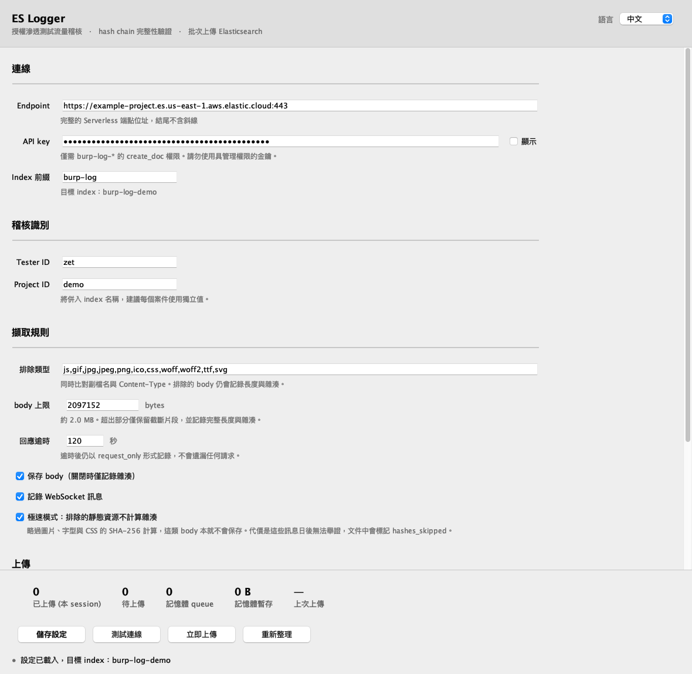

# ES Logger

[](https://github.com/cymetrics/burp-es-logger/actions/workflows/build.yml)
[](LICENSE)

把 Burp 經手的 HTTP / WebSocket 流量鏡射到 Elasticsearch 的擴充，
讓一場測試的請求在 Burp 專案關掉很久以後仍然查得到。
紀錄之間以雜湊串接，所以事後對儲存副本的修改會留下痕跡。

**它不是一場測試的完整紀錄。** 它只看得到經過 Burp 的流量 ——
sqlmap、ffuf、nuclei、nmap 以及任何沒有導進 proxy 的腳本都不在其中，詳見[涵蓋範圍](#涵蓋範圍)。

> English: [README.md](README.md)



## 為什麼需要它

Burp 的專案檔不適合當封存：它是單一台機器上的二進位檔、搜尋很慢，
而且重灌之後就沒了。這個擴充把同樣的流量放進 Elasticsearch，一個案子一個 index，
每筆都標記工具、測試者與 session —— 「上週二我用 Repeater 對這台主機送了什麼」
就變成一句查詢，而不是一個下午。

## 做什麼

- **涵蓋 Burp 送出的一切。** 掛在 `api.http()`，所以 Proxy、Repeater、Intruder、Scanner
  以及其他 extension 的流量都收得到，不只是瀏覽器經過 proxy 的部分。
- **用 `messageId` 配對請求與回應。** 沒等到回應的請求逾時後仍以 `request_only` 落檔，
  不會無聲消失。
- **決定什麼值得保存。** body 依副檔名與 Content-Type 過濾並有大小上限，
  讓 index 維持在查得動的狀態。被排除的 body 仍會記錄長度與雜湊。
- **絕不重複。** `_bulk` 用 `create` 搭配自訂 `_id`，網路中斷後重送會得到 409，視為已存在。
- **不干擾 Burp。** 擷取回呼只取位元組就交給背景執行緒；上傳走釘死 `NO_PROXY` 的 JDK
  `HttpClient`，所以擴充不會記錄自己的流量，API key 也不可能進到 proxy history。

## 快速開始

1. **下載** [Releases](https://github.com/cymetrics/burp-es-logger/releases) 的
   `burp-es-logger.jar` 並驗證：
   ```bash
   shasum -a 256 -c burp-es-logger.jar.sha256
   ```
2. **準備 Elasticsearch** —— 照 [`elasticsearch/setup.md`](elasticsearch/setup.md) 建立 index
   template，並產生一把只能新增、不能讀 / 改 / 刪的 API key。
   [`elasticsearch/dev-tools.txt`](elasticsearch/dev-tools.txt) 是同樣內容，可直接貼進 Kibana 的
   Dev Tools。
3. **載入擴充** —— Burp → Extensions → Add → Extension type 選 **Java** → 選那個 jar，
   會多出 **ES Logger** 分頁。打算反覆重編就把 **Auto-reload** 打開。
4. **填寫分頁** —— endpoint、API key、index 前綴、Tester ID、Project ID →
   **儲存設定** → **測試連線**。那裡出現 403 是預期的且畫面會解釋；401 才是真的有問題。

## 涵蓋範圍

擴充掛在 `api.http()` 上，所以 **Burp** 送出的一切都收得到，Burp 以外的一概收不到。
多數工具可以導進 Burp 的 proxy，這樣就會進到同一份紀錄：

```bash
sqlmap --proxy http://127.0.0.1:8080
ffuf   -x http://127.0.0.1:8080
nuclei -proxy http://127.0.0.1:8080
curl   -x http://127.0.0.1:8080 -k
export HTTP_PROXY=http://127.0.0.1:8080 HTTPS_PROXY=http://127.0.0.1:8080
```

不走 HTTP proxy 的東西 —— nmap、DNS、raw socket、SSH tunnel —— 無論如何都在紀錄之外。
請把這個 index 當成「這場測試中 Burp 的那一半」，報告裡也照這樣寫，不要暗示它涵蓋全部。

## 設定項目

| 項目 | 預設 | 說明 |
|---|---|---|
| Endpoint | — | 完整網址，結尾不要斜線 |
| API key (encoded) | — | 只需要 `burp-log-*` 的 `create_doc` 權限 |
| Index 前綴 | `burp-log` | 實際 index 為 `<前綴>-<project id>` |
| Tester / Project ID | — | 寫入每一筆文件；project ID 同時決定 index 名稱 |
| 排除類型 | `js,gif,jpg,jpeg,png,ico,css,woff,woff2,ttf,svg` | 同時比對副檔名與 Content-Type |
| body 上限 | 2 MB | 超出部分只留截斷片段 + 完整長度與雜湊 |
| 回應逾時 | 120 秒 | 逾時後以 `request_only` 記錄 |
| 保存 body | 開 | 關閉則只記雜湊 |
| 記錄 WebSocket 訊息 | 開 | |
| 極速模式 | **開** | 省掉被排除靜態資源的 body 雜湊；`raw_sha256` 一律保留 |
| 上傳間隔 | 15 秒 | 只是閒置輪詢；有積壓會連續送 |
| 每批筆數 | 500 | 另有單次 `_bulk` 8 MB 的上限 |
| 啟用自動上傳 | 開 | |
| 落地到 SQLite | **關** | 開啟＝用磁碟換取跨重啟的完整性 |

設定存在 Burp 的使用者偏好設定裡，跨專案共用。切換落地模式需要重載擴充，其餘存檔即生效。

## 設計取捨

這些都是刻意的決定，實際用在案子上之前請先看過。

**本地暫存不是封存。** 預設完全不寫磁碟：待上傳的紀錄放在 32 MB 的記憶體佇列裡，
Elasticsearch 一確認就刪除。Burp 關閉或積壓超過上限時，未送出的會遺失 —— 而因為 `seq`
持續遞增，缺口是**看得見的**。想用磁碟換完整性就打開 SQLite 落地。

**Elasticsearch 是唯一的稽核來源。** hash chain 證明的是「現有的沒有被改過」，
不是「沒有東西不見」。請搭配 append-only 的 API key，讓測試機即使被入侵也改不了已上傳的紀錄。

**ES 永遠不會接受的紀錄最終會被放棄。** 伺服器錯誤、流量限制與認證失敗都會無限重試 ——
那是伺服器或金鑰的問題，資料本身沒錯。但文件自身的問題（例如 mapping 衝突）不處理就會
永遠卡住它後面的每一筆，所以這種批次會反覆對半切以逼近出問題的那一筆，該筆三次之後放棄，
而且講得很大聲：Burp dashboard 的 critical 事件、分頁上的計數，以及 `seq` 留下的缺號。

**極速模式只省被排除靜態資源的 body 雜湊。** 圖片、字型、CSS 是客戶自己的資源，
本來就不會保存 body。`raw_sha256` 一律計算，所以整包訊息仍然可驗證，
只是少了單獨的 body 摘要，紀錄會標記 `hashes_skipped: true`。

## 文件

| | |
|---|---|
| [架構](docs/architecture.md) | 處理流程、執行緒，以及每一道讓記憶體有界的上限 |
| [完整性](docs/integrity.md) | 鏈的公式、怎麼驗證，以及它證明不了什麼 |
| [查詢](docs/queries.md) | 你真的會問的那些問題對應的 Kibana 查詢 |
| [疑難排解](docs/troubleshooting.md) | 載不進去、沒在上傳、紀錄被丟棄 |
| [Elasticsearch 設定](elasticsearch/setup.md) | index template 與 append-only 金鑰 |

（文件本身為英文，與程式碼註解分開維護。）

## 實際用在案子之前

- 這些 log 含受測方的**帳密、session token 與個資**，而且會離開本機存到第三方雲端。
  請先確認測試合約與 NDA 允許，以及資料落地區域是否有限制。
- Scanner 與 Intruder 一次可能產生數十萬筆。請先估資料量與費用，
  必要時對這兩個工具關閉 body 或調低大小上限。
- API key 以明文存在 Burp 的使用者偏好設定中。請保護測試機，並在結案時撤銷金鑰。

## 已知限制

- API key 尚未接 OS keychain。
- 二進位 body 以 base64 進 ES 會膨脹約 33%，已用大小上限與截斷夾住。
- 文字 body 以 UTF-8 解碼，非法位元組會變成 U+FFFD，存下的文字因此與 `body_sha256` 不一致；
  `raw_sha256` 仍涵蓋原始位元組。
- hash chain 偵測竄改，但不能阻止竄改。**只刪尾端無法單靠 index 偵測** ——
  補救方式見[完整性](docs/integrity.md#what-this-does-and-does-not-prove)裡的外部錨點做法。
- 測試途中更改 index 前綴或 Project ID，已擷取但未上傳的紀錄會被送到新的 index，
  同一條鏈會被切成兩半。請在開始擷取之前就設定好。

## 開發

需要 JDK 17；Gradle 不支援 JDK 25 以上。

```bash
JAVA_HOME=$(/usr/libexec/java_home -v 17) ./gradlew test shadowJar
# → build/libs/burp-es-logger.jar

./gradlew renderScreenshot   # 從真實 UI 程式碼重新產生 docs/screenshot*.png
```

jar 內含 macOS、Windows、Linux（含 musl）的 SQLite 原生函式庫，同一個檔案在各平台都能用。
CI 會驗證 Gradle wrapper 的雜湊、跑測試，並在發布前確認 Montoya 入口宣告存在。

## 授權

MIT，見 [LICENSE](LICENSE)。
